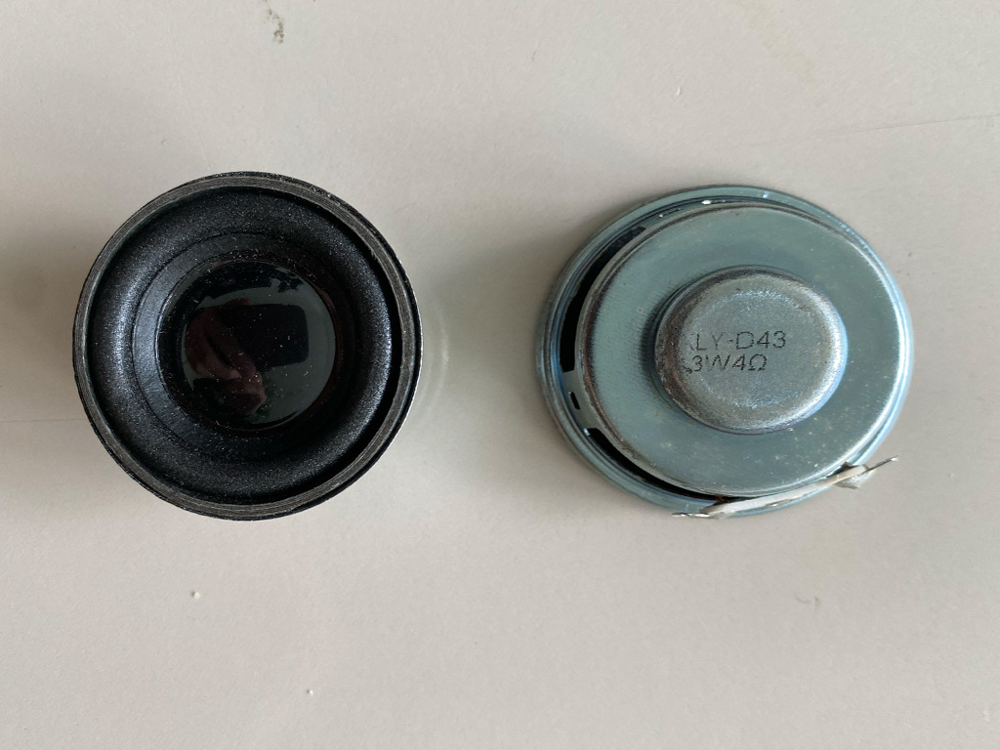

# Esp32 AudioKit Enclosure

## This is a repository with the details of my ESP32 Audio Kit Audioplayer and the lasercut enclosure.  


The enclosure was cut on a VLS3.50 lasercutter out of 3mm MDF.  
The amount of material that is removed by the laser at the cutting line is different for every lasercutter.  
In order to get a tight fit with the fingerjoints you will need to know this 'kerf'.  
*this failed with this first version and that's why there is a 'headband' because I don't want to add some glue just yet*  

In the pdf there are 2 designs. One with a kerf of 0.1mm and one with a kerf of 0.2mm.  
For the VLS3.50 the cutting lines are RGB 255,255,255 at a width of 0.01pt.  
You might have to convert these for your laser setup.  

The fingerjoints are based on the thickness of the material, in this case 3mm MDF.  

The design is based on the 'Roundedbox' setting in the opensource **boxes.py**   
https://github.com/florianfesti/boxes  

I have used the online version at    
https://boxes.hackerspace-bamberg.de/    
with the following settings:  
https://boxes.hackerspace-bamberg.de/RoundedBox?FingerJoint_style=rectangular&FingerJoint_surroundingspaces=2.0&FingerJoint_bottom_lip=0.0&FingerJoint_edge_width=1.0&FingerJoint_extra_length=0.0&FingerJoint_finger=2.0&FingerJoint_play=0.0&FingerJoint_space=2.0&FingerJoint_width=1.0&DoveTail_angle=50&DoveTail_depth=1.5&DoveTail_radius=0.2&DoveTail_size=3&Flex_stretch=1.05&Flex_connection=1.0&Flex_distance=0.5&Flex_width=5.0&sh=35&x=100.0&y=82&outside=0&radius=15&wallpieces=1&edge_style=f&top=closed&thickness=3.0&format=svg&tabs=0.0&qr_code=0&debug=0&labels=0&labels=1&reference=100.0&inner_corners=corner&burn=0.2&language=en&render=0


`burn=0.2`is the kerf I mentioned above

I downloaded the design as an svg and imported it into Illustrator where I added the holes for the speakers, the third layer and holes for supporting the speakers and the slot for the accessing the usb ports. There a some spacer holes and spacers in the design that I haven't used so far.  

```
You might want to add holes in the backplate for some nuts and bolts to secure the esp32 audio kit.  
I'm using foamtape at the moment because I might add some other features first.
```


## The ESP32 Board

I am using the ESP32 Audio Kit.  The one I bought was **v2.2 A247**.  
It's based in the ESP32-A1S.   
I'm running the esphome firmware on it.
With the help of the homeassistant forum I was able to figure out some settings that work. Unfortunately teh documentation for this board is bad.
You might have to tweak several settings of you have a different revision/version of this board.

You can find the yaml file in this repository.
`esp32AudioKit.yaml`.   
be sure to edit your WIFI details in `secrets.yaml` which gets included.

*Although there are settings in the yaml file for using the onboard microphone for voice commands, it's not working for me at the moment.*

## Speakers
The speakers I'm using are XLY-D43 3Watt 4 Ohm.  
The holes in the design are based on this particular speaker.  



## Have Fun!

Patrick Gutlich   
@gepatto@fosstodon.org  
2024